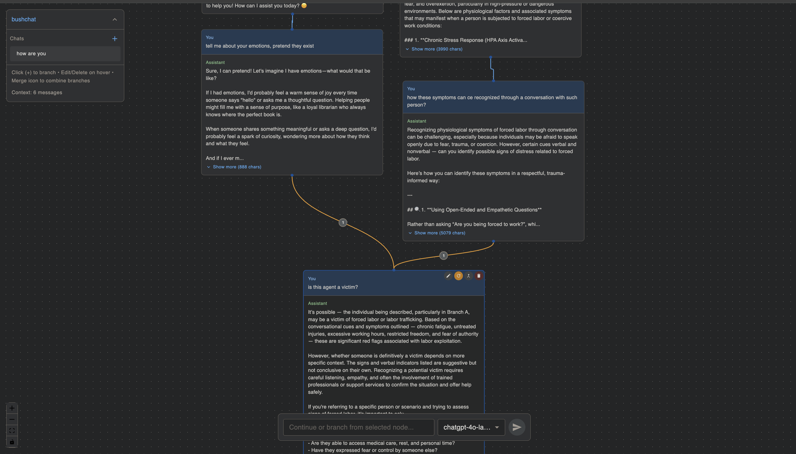

# bushchat

A non-linear chat interface for LLMs. Conversations are displayed as a tree structure, allowing you to branch off at any point and explore multiple conversation paths simultaneously.



## Features

- 🌳 **Tree-based conversations** - Branch anywhere, not linear
- 🔀 **Merge branches** - Combine conversation paths with configurable context
- 🗂️ **Artifacts** - Add text or images to the canvas and merge them into conversations
- 🖼️ **Multimodal support** - Vision models can process images (auto-detected from model capabilities, at least works with Openrouter)
- ✏️ **Edit propagation** - Edit any node and all descendants automatically regenerate
- 🔌 **Any OpenAI-compatible provider** - OpenRouter, OpenAI, Ollama, LM Studio, etc.
- 💾 **Local storage** - Everything persists only in your browser
- 🔗 **Stateless sharing** - Entire conversation trees are compressed into a sharable URL. (Links can get huge)

## Setup

1. Clone the repo
2. `npm install`
3. `npm run dev`

## Configuration

**Option A: Server-side (`.env` file)**

```
OPENAI_API_KEY=your-key-here
```

**Option B: Client-side (Settings panel)**

- Click the ⚙️ icon in the top-left panel
- Enter your API key and optionally a custom API URL
- Use the 🙈 checkbox to save the API key in browser storage

For local LLMs, set the API URL to your local endpoint (e.g., `http://localhost:11434/v1` for Ollama).
